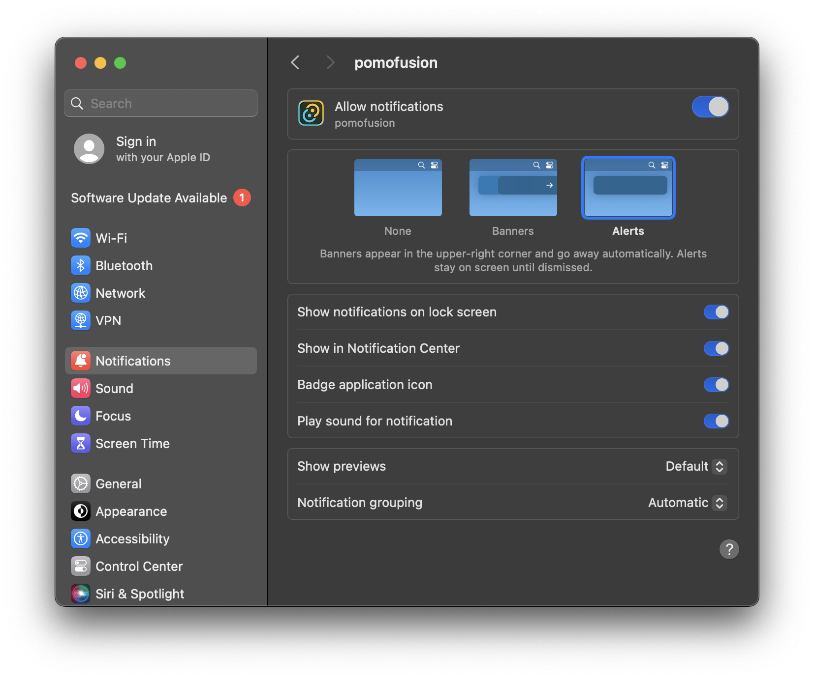

<div align="center"></div>
<div align="center"><h1>PomoFusion</h1></div>

A simple Pomodoro timer with a Spotify integration.

Currently, PomoFusion only support playback controls with no other functionality. This means while the playback is controlled automatically, things such as shuffling, changing the current playing track, etc. must be modified in the Slack application.

> [!IMPORTANT]
> PomoFusion is operational, but unfortunately, the application does not work in a release state. I believe this is due to the Spotify API callback functionality and Tauri no longer utilizing the localhost address that it uses during development. I will mess with this more later when I can, but for now, if you follow the build instructions below, you can run the application locally.

## How to Authenticate

Create a `spotify.json` file under `/opt/pomofusion` and add your credentials into the file. If you need any help, check out the `spotify.json` example file to know which variables to include.

> [!NOTE]
> The spotify.json must be configured exactly like the example. All keys must be present for the Spotify API to work properly.

## Build

To build the Tauri application, simply install your modules and then run the Tauri development command.

### Install Modules

This will install all required `node_modules` for the application

```bash
npm i
```

### Run Tauri

This will run the Tauri instance for you. You should be able to use `npm` or `npx`
```bash
npx tauri dev
```

## FAQ / Help Guide

> [!IMPORTANT]
>
> ### PomoFusion is unable to locate a device. Help?
>
> Spotify may have a difficult time locating your active device or session. A potential fix for this is to restart the Spotify application, play a song for a few seconds, and then pause the song. Once you've done this, Spotify shouldn't have any issues locating your active session.

> [!IMPORTANT]
>
> ### I'm not receiving any notifications from PomoFusion. What's wrong?
>
> First, make sure you've alloted the proper permissions for the application. I've attached a screenshot below.
>
> <div align="center"></div>

### Copyright

The PomoFusion "logo" belongs to Yu-Gi-Oh and Konami, respectively. No monetary gain will ever be generated directly from PomoFusion while this image is associated with the project.
